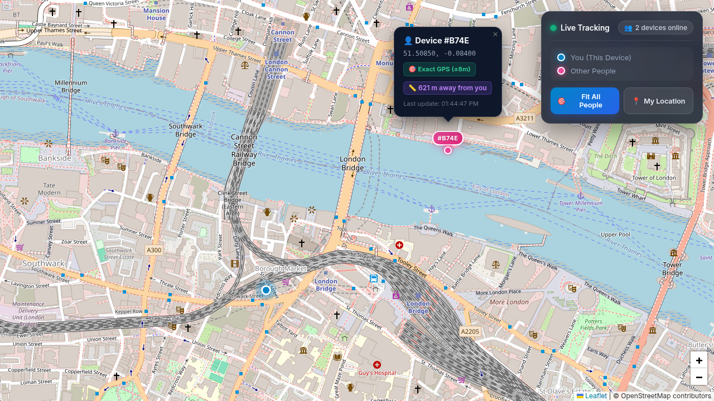
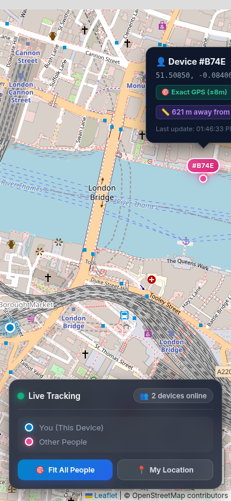

# 🛰️ Real-Time Live Locator

A high-performance real-time location tracking web application built with **Node.js**, **Express**, **Socket.IO**, and **Leaflet.js**. It enables multiple users and devices to view and track each other's live positions on an interactive world map in real time.

---

## 📸 Interface Previews

### 💻 Desktop Display


### 📱 Mobile Responsive Display
<p align="center">
  
</p>

---

## ✨ Features

- **🔴 Real-Time Bidirectional Tracking**: Powered by WebSockets (Socket.IO) for sub-second location synchronization.
- **📍 Distinguish "You" vs "Others"**:
  - **You (This Device)**: Electric cyan/blue GPS beacon with a continuous radar pulse animation.
  - **Other People**: Vibrant neon-rose pin with personalized short device ID badges (e.g., `#B74E`).
- **📏 Live Distance Measurement**: Real-time distance calculation between devices (`📏 621 m away from you`).
- **🎯 Dynamic Zoom & Auto-Framing**: Automatically adjusts map bounds (`fitBounds`) with padding so all active devices remain visible regardless of distance.
- **🛡️ GPS Jitter & Drift Filter**: Intelligent deadband noise suppression preventing stationary devices from wandering.
- **🎛️ Glassmorphic HUD & Controls**:
  - Live connection status indicator (Connecting / Live / Blocked).
  - Real-time online devices counter (`X devices online`).
  - **`🎯 Fit All People`**: Instantly reframes the map to keep all trackers in view.
  - **`📍 My Location`**: Smooth fly-to animation to street-level zoom on your current device.
  - Built-in visual map legend.
- **🔔 Interactive Popups & Toast Notifications**:
  - Displays high-precision coordinates, accuracy radius (GPS vs Wi-Fi), and distance badge.
  - Automatic toasts when devices join or disconnect.
- **📱 Fully Responsive**: Custom layout adapted for desktop displays and thumb-friendly mobile touchscreens.

---

## 🛠️ Tech Stack

- **Backend**: [Node.js](https://nodejs.org/), [Express](https://expressjs.com/), [Socket.IO](https://socket.io/), [EJS](https://ejs.co/)
- **Frontend**: Vanilla JavaScript (ES6+), [Leaflet.js](https://leafletjs.com/), [OpenStreetMap](https://www.openstreetmap.org/)
- **Styling**: Vanilla CSS3 (Glassmorphism, CSS Variables, Keyframe Animations, Flexbox)
- **APIs**: HTML5 Geolocation API (`navigator.geolocation`)

---

## 📁 Project Structure

```text
Real Time Locator/
├── app.js                   # Express server & Socket.IO event handler
├── package.json             # Dependencies and project scripts
├── public/
│   ├── images/
│   │   ├── desktop-preview.png # Desktop interface screenshot
│   │   └── mobile-preview.png  # Mobile responsive screenshot
│   ├── javascripts/
│   │   └── script.js        # Leaflet map logic, custom DivIcons & socket events
│   └── stylesheets/
│       └── style.css        # Glassmorphic HUD, pulsating beacon animations & layout
└── views/
    └── index.ejs            # Main map template and HUD overlay
```

---

## 🚀 Getting Started

### 1. Prerequisites
Ensure you have [Node.js](https://nodejs.org/) installed (v16 or newer recommended).

### 2. Installation
Clone or navigate to the project directory:
```bash
cd "Real Time Locator"
npm install
```

### 3. Run the Server
Using nodemon (auto-restarts on code changes):
```bash
npx nodemon app.js
```
Or with standard node:
```bash
node app.js
```

The server binds to `0.0.0.0:3000` and is accessible at:
```text
http://localhost:3000
```

---

## 📱 How to Test (Laptop + Mobile Phone)

> [!IMPORTANT]
> **Mobile Browser Security Requirement:**  
> Modern mobile browsers (Chrome on Android, Safari on iOS) **block geolocation access** on non-localhost insecure origins (`http://`).  
> Use one of the two methods below to test with your mobile device:

### Option A: Using a Free HTTPS Tunnel (Recommended)
This gives you a secure `https://` link that allows GPS access on mobile without altering any browser settings.

1. Keep your server running (`node app.js`).
2. Open a separate terminal and run:
   ```bash
   npx localtunnel --port 3000
   ```
   *(Or `ngrok http 3000` if you use ngrok).*
3. Open `http://localhost:3000` on your **Laptop**.
4. Open the generated `https://...` link on your **Mobile Phone**.
5. Grant location permissions on both devices. Walk or move with your phone to see its pin move on your laptop in real time!

---

### Option B: Local Wi-Fi (Android Chrome Flag)
If both devices are connected to the same Wi-Fi router:

1. Find your laptop's local IP address (`hostname -I` on Linux or `ipconfig` on Windows).
2. On your Android phone, open Chrome and visit:
   ```text
   chrome://flags/#unsafely-treat-insecure-origin-as-secure
   ```
3. Enable the flag, enter your laptop's address (e.g. `http://<laptop-ip>:3000`), and tap **Relaunch**.
4. Navigate to `http://<laptop-ip>:3000` on your phone and allow location permissions.

---

### Option C: Simulating Multiple People on a Single Laptop
You can test multi-user movement without leaving your desk using Chrome DevTools:

1. Open `http://localhost:3000` in your primary browser window.
2. Open an **Incognito Window** to `http://localhost:3000`.
3. In the Incognito window, press `F12` to open DevTools.
4. Press `Ctrl+Shift+P` (or `Cmd+Shift+P`), type **Sensors**, and select **Show Sensors**.
5. Under **Location**, pick a city (e.g. *London* or *San Francisco*) or drag custom coordinates.
6. Observe both windows: the map will instantly auto-adjust bounds and show both devices!

---

## 📄 License
ISC
